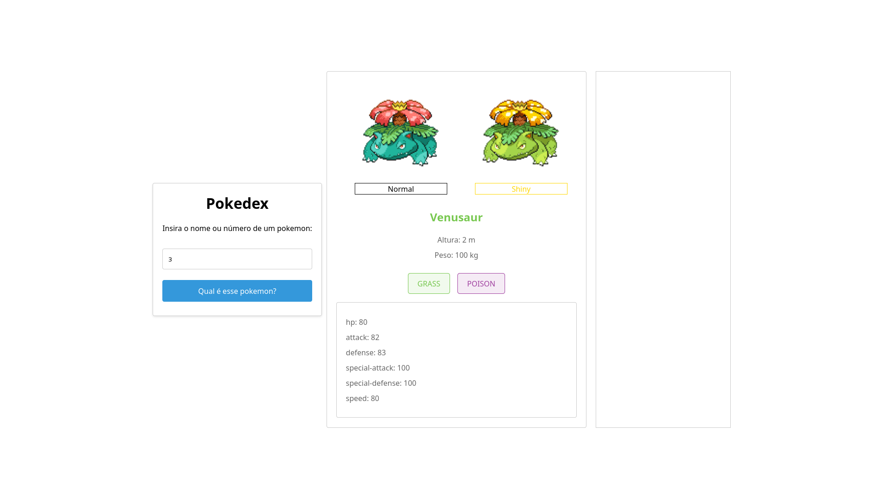
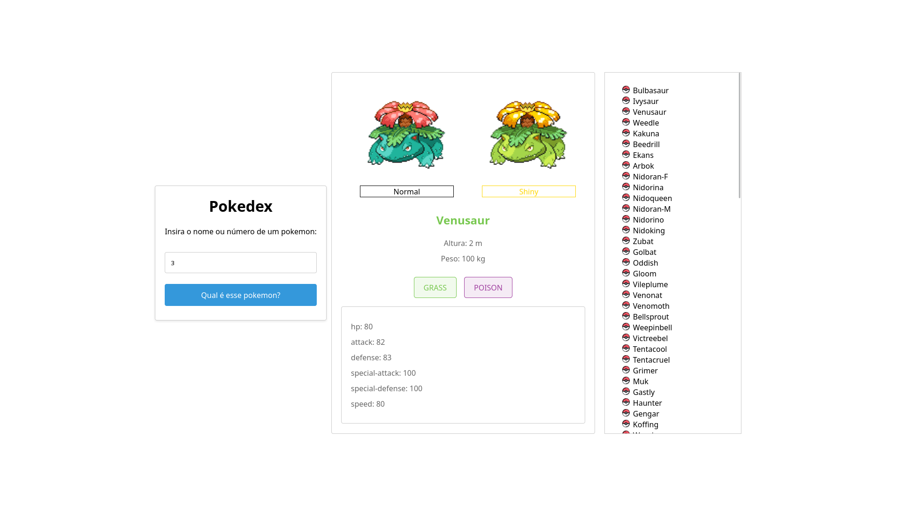

# Português
Olá a qualquer um que interessar, esse projeto é um experimento. 

Ele foi inteiramente desenvolvido através de sugestões fornecidas ao https://chat.openai.com/chat da OpenAI

Em alguns casos foram necessário realizar ajustes, mas não interferi no código como um todo, no final o resultado foi surpreendente, a AI conseguiu fazer uma pokedex funcional e até que bem legal.

Enfim, aqui está o Readme gerado pelo chat para esse projeto:

## Pokedex
Esse projeto foi criado com o objetivo de explorar a API de pokemons e desenvolver um aplicativo de pokedex.

Para isso, foi utilizada a biblioteca axios para realizar chamadas HTTP à API de pokemons e obter informações sobre os pokemons, como nome, tipos e imagem. Além disso, foi utilizado o React para criar a interface do aplicativo, permitindo que o usuário pesquise por um pokemon específico ou veja a lista de pokemons de um determinado tipo.

O css foi utilizado parsa estilizar a interface do aplicativo e dar um toque mais divertido, como cores que correspondem aos tipos dos pokemons e imagens de markers personalizados para cada tipo.

Além disso, foi implementada uma função que recebe o nome de um pokemon e retorna seu tipo principal, permitindo que os pokemons sejam exibidos na lista com a cor correspondente ao seu tipo.

Para finalizar, foi adicionado um scroll na lista de pokemons para facilitar a navegação pelo aplicativo.

Esse projeto foi desenvolvido com o auxílio do Assistant, uma ferramenta de linguagem natural treinada por OpenAI.

# English
Hello people, this project is an experiment.

It was entirely developed using suggestions provided to OpenAI's https://chat.openai.com/chat

In some cases it was necessary to make adjustments, but I didn't really change the code, in the end the result was surprising, the AI managed to make a functional and even pretty cool pokedex.

Anyway, here is the Readme generated by the chat for that project:
## Pokedex

This project was created using the OpenAI Assistant to help with the implementation of a Pokedex, a tool that allows users to search for Pokemon by name or number and display information about them.

To start, the Assistant provided guidance on setting up the project structure and installing the necessary dependencies, including React and Axios for making API calls.

The Assistant also helped with the implementation of the PokemonTypeList component, which displays a list of Pokemon of a certain type. It recommended using the useEffect hook to fetch the data from the PokeAPI and the useState hook to manage the state of the component.

Additionally, the Assistant suggested creating a function to retrieve the primary type of a Pokemon by its name, using the axios library to make the API call and returning the type as a string. This function was then used to apply custom CSS styles to each Pokemon element in the list, using the type as a class name.

Overall, the Assistant was a valuable resource in the development of this Pokedex, providing insights and guidance on various aspects of the project.

# Imagens

